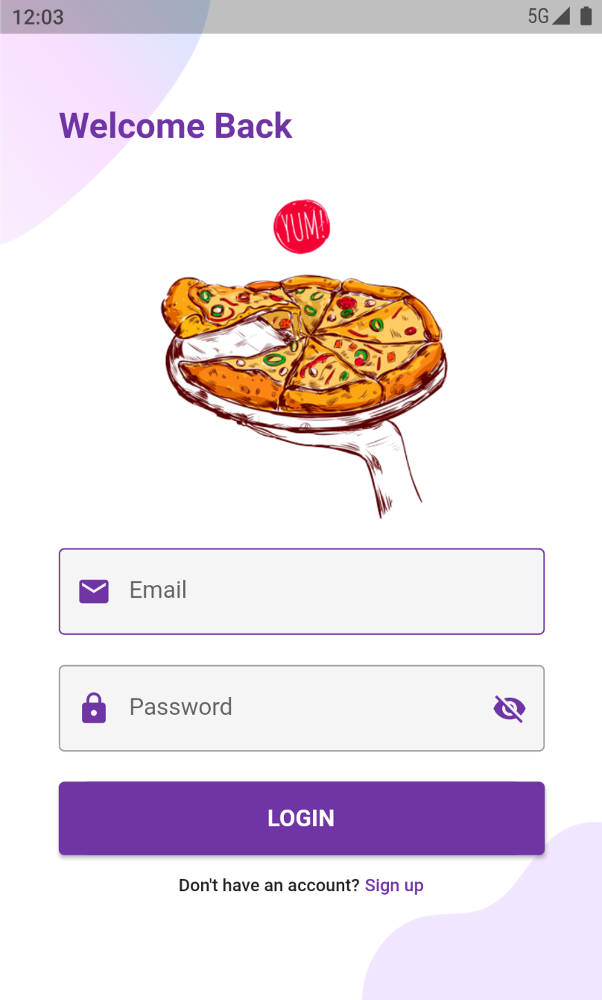

# Multi-vendor Pizza Delivery E-Commerce app

Multi-vendor Pizza Delivery E-Commerce app built with Flutter and Firebase

## Core Packages

1. firebase - Backend(firestore, firebase-auth, google-sign-in)
2. shared_preferences
3. carousel_pro - Carousel slider
4. flutter_spinkit - Spinner on loading
5. provider - State management
6. uuid - Unique userId
7. stripe_payment - Payment gateway

## Features

- Login / Signup
- Product Catalouge
- Cart
- Create Order
- View Restaurants
- Search Products
- Search Restaurants
- Search Filters
- View Profile
- Edit Profile

## How to setup locally

- Create a new project in firebase and download the google-services.json file
- Make sure you have place this file in android/app folder

- Then connect a android device and run <code>flutter run</code> to see the mobile app in action.

## UI

## Login

## Home

## Product Catalouge

## Profile

## Edit Profile

## Cart

## Search

## Orders
